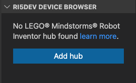
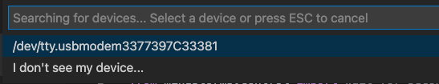
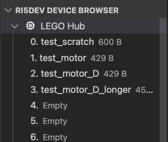
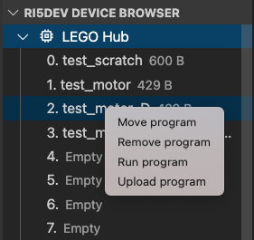

# VScode extension for the Robot inventor set

This is my attempt at writing a Microsoft Visual Studio Code extension to
program the LEGO® MINDSTORMS® Robot Inventor set in MicroPython.

## Known limitations

- I wrote and tested the extension on macOS. I am not sure if it works in
  Windows or Linux out of the box
- The connection to the Hub only works via USB at the moment. I tried to connect
  via Bluetooth and it somehow works but it's unstable and it fails from time
  to time, still not sure why.

## How to use it

After installing the extension open the RI5DEV device browser:

and click on "Add LEGO Hub". The Hub must be connected via USB. Select the
device:

The extension will retrieve the storage status of the Hub and will show all
available programs.

You can then right click on any slot and perform any of the
following operations:

1. Execute a program
2. Remove a program
3. Move a program from one slot to another
4. Upload a program. You need to have the corresponding micropython file open.

Also, by right-clicking on the Hub you can select the command to stop the
execution of a program.

## Useful links and external references

Since there is no official documentation for the API, the implementation is based
on what I could discover empirically.
I also obtained information from the following repositories, based on the LEGO®
Education SPIKE™️ Prime Set:
- [gpdaniels/spike-prime](https://github.com/gpdaniels/spike-prime/blob/master/specifications/stm32f413.pdf)
- [nutki/spike-tools](https://github.com/nutki/spike-tools)
- [sanjayseshan/spikeprime-tools](https://github.com/sanjayseshan/spikeprime-tools)

_LEGO and Mindstorms are trademarks of the LEGO Groups._